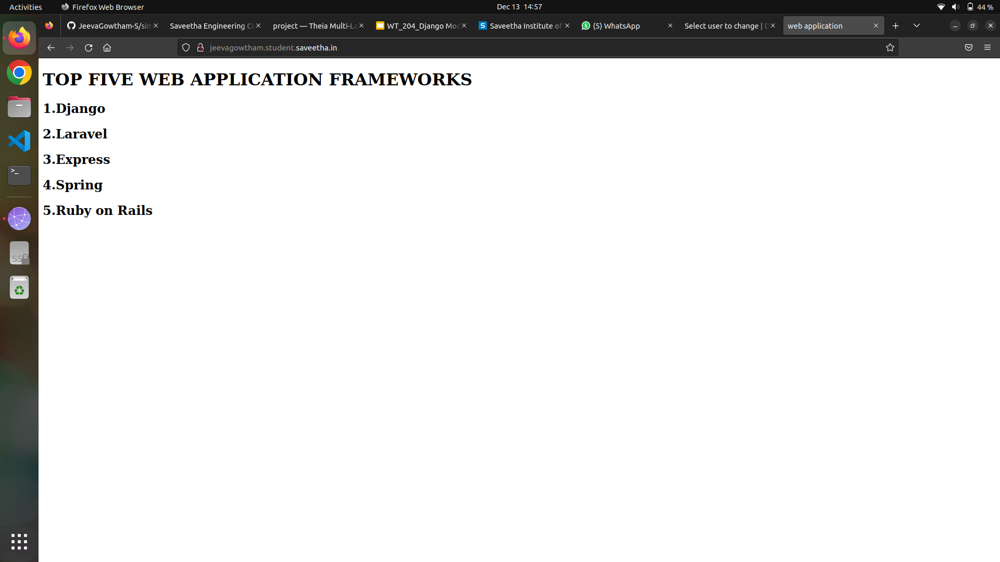
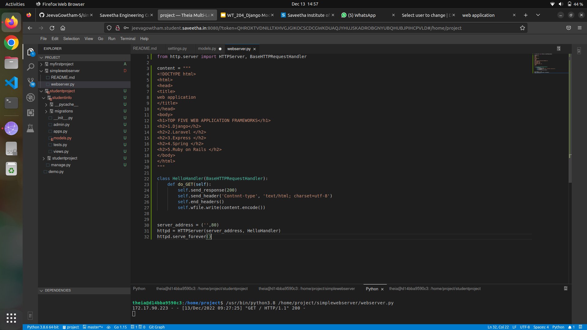

# Developing a Simple Webserver
## AIM:
To develop a simple webserver to display top five frameworks.

## DESIGN STEPS:
### Step 1: 
HTML content creation
### Step 2:
Design of webserver workflow
### Step 3:
Implementation using Python code
### Step 4:
Serving the HTML pages.
### Step 5:
Testing the webserver

## PROGRAM:
```
from http.server import HTTPServer, BaseHTTPRequestHandler

content = """
<!DOCTYPE html>
<html>
<head>
<title>
web application
</title>
</head>
<body>
<h1>TOP FIVE WEB APPLICATION FRAMEWORKS</h1>
<h2>1.Django</h2>
<h2>2.Laravel </h2>
<h2>3.Express /h2>
<h2>4.Spring </h2>
<h2>5.Ruby on Rails </h2>
</body>
</html>
"""

class HelloHandler(BaseHTTPRequestHandler):
    def do_GET(self):
        self.send_response(200)
        self.send_header('Contnnt-type', 'text/html; charset=utf-8')
        self.end_headers()
        self.wfile.write(content.encode())


server_address = ('',80)
httpd = HTTPServer(server_address, HelloHandler)
httpd.serve_forever()
```


## OUTPUT:
### Client Side:

### Server Side:


## RESULT:
